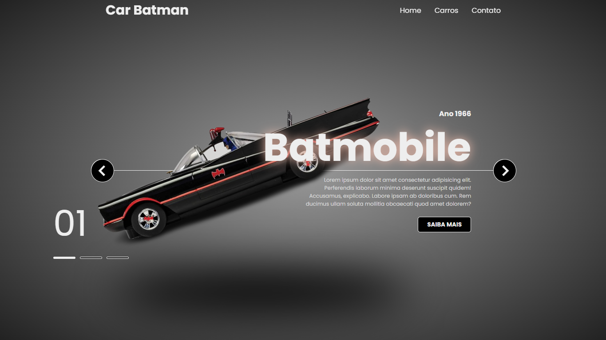
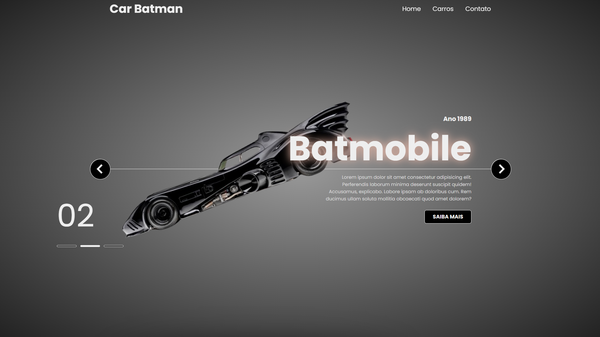
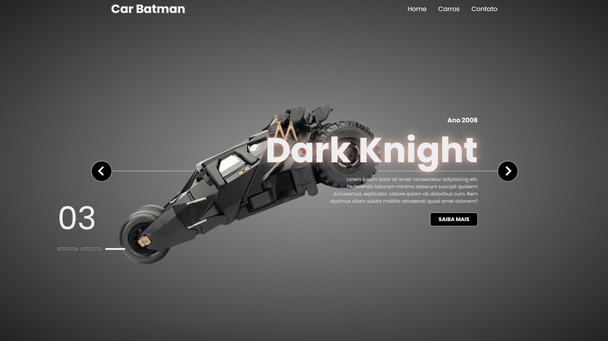

<h1 align="center">Car Batman</h1>

<h2>Olá sejam bem-vindo</h2>

🦇 Batmóveis: Desvendando os Carros Lendários do Cavaleiro das Trevas

Batmóveis: Desvendando os Carros Lendários do Cavaleiro das Trevas
Apaixonado por Batman e desenvolvimento web?  Então este projeto é para você!

Criei um carrossel responsivo com HTML, CSS e JavaScript para exibir os Batmóveis mais icônicos da história do Homem-Morcego. ️

<h4>O que você encontrará neste projeto:</h4>
<ul>
<li>Design responsivo: O carrossel se adapta perfeitamente a diferentes tamanhos de tela, desde desktops até smartphones.</li>
<li>Informações detalhadas: Cada Batmóvel possui uma breve descrição.</li>
<li>Efeitos visuais: Animações suaves e transições elegantes tornam a experiência ainda mais imersiva..</li>
</ul>

<h4>Desenvolvimento:</h4>
<ul>
<li>HTML: Estruturação da página e organização do conteúdo.</li>
<li>CSS: Estilização visual do carrossel, dos Batmóveis e das informações.</li>
<li>JavaScript: Adição de funcionalidades interativas, como navegação e efeitos visuais.</li>
</ul>

Gostou do que viu? Deixe seu comentário e compartilhe com seus amigos!

<h4>Link:</h4>

> Portfólio: https://daliosy.github.io/my-PORTFOLIO

> Deploy: https://daliosy.github.io/car-batman

> Linkedin: https://www.linkedin.com/in/dalio-s-yamada/

#batman #carros #carrossel #html #css #javascript #desenvolvimentoweb #responsivo #projeto

 

  <ul align="center">
    <h2 style="display: inline-block">Imagens:</h2>
  </ul>

 
  
  
  
 

